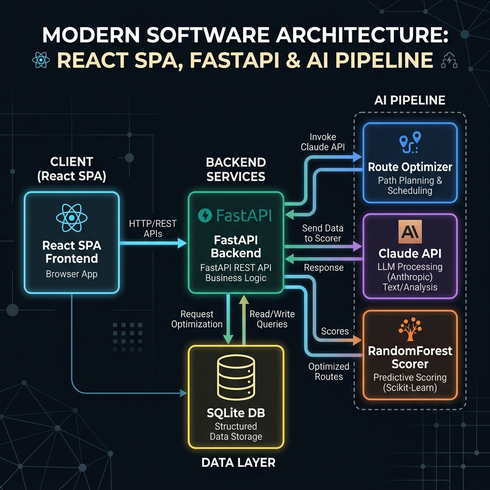

# LEIN — Lagos Emergency Intelligence Network
> AI-powered emergency dispatch and triage coordination for Lagos. Built in 48 hours.

## The Problem
Lagos handles over 20 million residents across 20 LGAs with no unified emergency coordination system.
Dispatchers use WhatsApp and phone calls, ambulances arrive at full hospitals, and language barriers
slow intake — most callers speak Pidgin, not formal English. LEIN solves all three.

## How AI Powers LEIN
1. **NLP Classifier** — Claude API classifies free-text (English + Pidgin) into type + confidence + keywords
2. **Severity Scorer** — RandomForestRegressor predicts priority score 1–10 from incident features
3. **Route Optimiser** — Haversine + LGA traffic multipliers selects nearest available responder
4. **Incident Forecaster** — RandomForest with lag features predicts next 6 hours by type + LGA

## Tech Stack
| Layer | Technology |
|---|---|
| Frontend | React (Vite), React Router, Framer Motion, GSAP, Leaflet, Recharts, Axios |
| Backend | FastAPI, SQLAlchemy, Pydantic, Alembic, SQLite |
| AI/ML | Claude API, scikit-learn, RandomForest, TF-IDF, joblib |

## Setup
```bash
git clone <repo-url>
cd LEIN

# Backend
cd backend
pip install -r requirements.txt
uvicorn main:app --reload --port 8000

# Frontend (new terminal)
cd frontend
npm install
npm run dev
```
Open http://localhost:5173

## Team
- **Muiz** — Frontend Engineer
- **Awwal** — Backend Engineer  
- **Jafar** — ML/AI Engineer

## Architecture


```
Browser (React SPA)
    │
    ├── /report → POST /report → incidents table (SQLite)
    ├── /dashboard → GET /incidents → AI priority score sort
    │                POST /assign → Route Optimiser → ETA
    └── /analytics → GET /stats/heatmap + GET /forecast
                          │
                    FastAPI Backend
                          │
                    AI Pipeline
                    ├── NLP Classifier (Claude API)
                    ├── Severity Scorer (RandomForest)
                    ├── Route Optimiser (Haversine)
                    └── Incident Forecaster (RandomForest)
                          │
                       SQLite DB
```